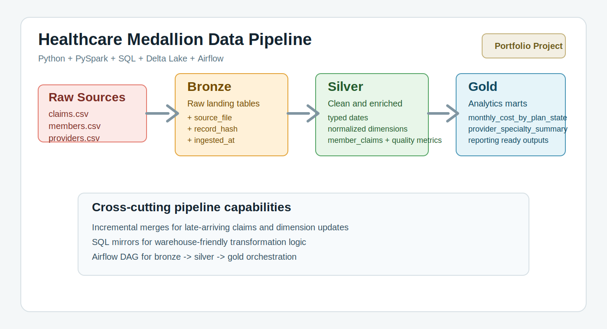

# Healthcare Medallion Data Engineering Project

Portfolio-ready healthcare data engineering project for payer-style claims analytics using Python, PySpark, SQL, Delta Lake, Airflow, and medallion architecture.



## Why this repo stands out

- realistic healthcare domain model with claims, members, and providers
- medallion data lake pattern with `bronze`, `silver`, and `gold` layers
- incremental Delta merge logic for late-arriving healthcare claims
- business-ready gold aggregates for cost, plan, state, and provider analysis
- Airflow orchestration artifact for production-style scheduling
- Great Expectations quality gates with JSON validation reports
- SQL equivalents alongside Spark transformations
- lightweight test coverage and GitHub Actions CI

## Tech stack

- Python 3.11
- PySpark 3.5
- SQL
- Delta Lake
- Great Expectations
- Apache Airflow
- GitHub Actions

## Project layout

```text
.
|-- conf/
|   `-- pipeline.yml
|-- data/
|   |-- raw/
|   |-- bronze/
|   |-- silver/
|   `-- gold/
|-- docs/
|   |-- architecture.md
|   `-- orchestration.md
|-- orchestration/
|   `-- airflow/
|       `-- dags/
|-- sql/
|   |-- bronze/
|   |-- silver/
|   `-- gold/
|-- src/healthcare_medallion/
|   |-- jobs/
|   |-- config.py
|   |-- io.py
|   |-- pipeline.py
|   |-- schemas.py
|   `-- spark.py
`-- tests/
```

## Architecture at a glance

1. `bronze`: land raw claims, members, and providers files into Delta tables with ingestion metadata.
2. `silver`: standardize types, validate records, and join claims with member and provider dimensions.
3. `gold`: publish curated aggregates for finance and provider performance reporting.
4. `airflow`: orchestrate bronze, silver, and gold execution in sequence.

See the detailed design notes in [docs/architecture.md](docs/architecture.md).

## Healthcare dataset used

This project uses a synthetic but realistic healthcare claims dataset with three core entities:

- `claims`: claim id, member id, provider id, diagnosis code, procedure code, billed amount, paid amount, claim status, service date
- `members`: member demographics and plan enrollment attributes
- `providers`: provider master data including specialty, location, and NPI

The use case is intentionally shaped like payer or insurance analytics, where the goal is to track cost, utilization, denial behavior, and provider performance.

## Transformations implemented

### Bronze

- read source CSV files with explicit schemas
- append ingestion metadata such as `source_file`, `record_hash`, `ingested_at`, and `record_source`
- merge changed source rows into Delta tables when incremental mode is enabled

### Silver

- cast raw dates into typed columns
- standardize state, city, specialty, and claim status values
- filter invalid claims with missing business keys or negative paid amounts
- join claims with member and provider reference data
- derive `claim_month`, `patient_responsibility`, `is_high_cost_claim`, and `last_touched_at`
- build `claim_quality_metrics` grouped by month, plan, and claim status

### Gold

- build `monthly_cost_by_plan_state`
- build `provider_specialty_summary`
- refresh only the impacted claim months during incremental runs

### Data quality

- Great Expectations suites validate bronze, silver, and gold outputs
- validation reports are written under `data/system/quality`
- the pipeline fails fast when a configured expectation does not pass

## Quick start

Recommended runtime: Python 3.11. Spark and Delta Lake are much happier there than on Python 3.14.

```bash
py -3.11 -m venv .venv
.venv\Scripts\Activate.ps1
python -m pip install -e .[dev]
python -m healthcare_medallion.pipeline --layer all
python -m pytest
```

On native Windows, Spark file writes can still fail with Hadoop `NativeIO` errors even after the Python version is fixed. When that happens, use WSL, Linux, or the Docker runner below. The pipeline code is ready; the blocker is the Windows Hadoop layer.

You can also run a single layer:

```bash
python -m healthcare_medallion.pipeline --layer bronze
python -m healthcare_medallion.pipeline --layer silver
python -m healthcare_medallion.pipeline --layer gold
```

## Storage format

The repo writes `bronze`, `silver`, and `gold` as Delta tables by default. That gives you:

- ACID transactions for batch updates
- time-travel-ready table storage once you move to a managed lakehouse runtime
- cleaner schema evolution than plain parquet folders

If you want a simpler local fallback later, you can switch the layer formats in [conf/pipeline.yml](conf/pipeline.yml).

## Docker run

This repo includes a Linux container path for reliable local execution on Windows hosts.

```bash
docker compose build
docker compose run --rm healthcare-pipeline
```

The container uses the same project files from the repo root, so outputs still land in `data/`.

## Incremental processing

Late-arriving claims are handled without forcing a full rebuild:

- `bronze` merges claims, members, and providers on business keys
- unchanged source rows keep their prior ingestion timestamp
- `silver` merges refreshed claim rows on `claim_id`
- `silver` writes the affected claim months to a small manifest under `data/system`
- `gold` refreshes only the months touched by the latest silver run

This keeps the project closer to how a real healthcare batch pipeline behaves once corrections and delayed claims start showing up.

## Sample business outputs

- `data/gold/monthly_cost_by_plan_state`
- `data/gold/provider_specialty_summary`

These are useful starting points for Power BI, Tableau, or downstream SQL reporting.

## Healthcare use case covered here

The synthetic dataset models:

- member enrollment data
- provider reference data
- medical claims with diagnosis, procedure, billed, and paid amounts

That gives you a realistic base for:

- data engineering portfolio projects
- interview walkthroughs
- healthcare analytics demos
- medallion architecture examples

## Airflow orchestration

The DAG lives at [orchestration/airflow/dags/healthcare_medallion_dag.py](orchestration/airflow/dags/healthcare_medallion_dag.py). It runs:

1. `bronze_ingestion`
2. `silver_transformations`
3. `gold_serving`

For setup notes, see [docs/orchestration.md](docs/orchestration.md).

## CI

GitHub Actions runs the test suite on every push and pull request through [ci.yml](.github/workflows/ci.yml).

